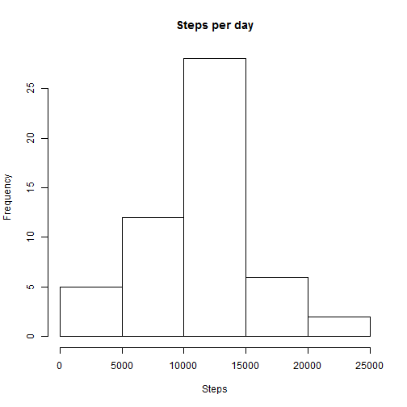
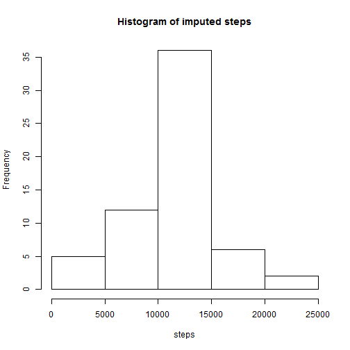
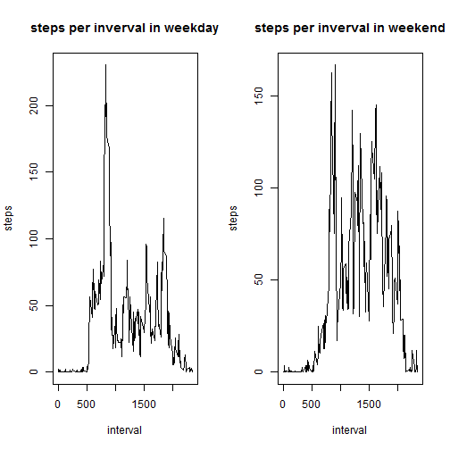

# Reproducible Research: Peer Assessment 1


## Loading and preprocessing the data


Before we can start, we need to set our working directory with the `setwd()` function, download the file and unzip it. The address from which we will obtain the data is:
`fileUrl<-"https://d396qusza40orc.cloudfront.net/repdata%2Fdata%2Factivity.zip"`
we need to download the file, for which we can use the following function:
`download.file(fileUrl,destfile="./Activity.zip")`
And as it is a `.zip` file, we need to unzip it using:
`unzip("./Activity.zip")`
Finally we can see what names have the files we unloaded with
`dir()`

After downloading the data, unzip it and setting the workdirectory, we can read it into R

```r
Activity<-read.csv("./Activity.csv")
head(Activity)
```

```
##   steps       date interval
## 1    NA 2012-10-01        0
## 2    NA 2012-10-01        5
## 3    NA 2012-10-01       10
## 4    NA 2012-10-01       15
## 5    NA 2012-10-01       20
## 6    NA 2012-10-01       25
```
Before making any analysis we must understand the type of elements in each variable:

```r
str(Activity)
```

```
## 'data.frame':	17568 obs. of  3 variables:
##  $ steps   : int  NA NA NA NA NA NA NA NA NA NA ...
##  $ date    : Factor w/ 61 levels "2012-10-01","2012-10-02",..: 1 1 1 1 1 1 1 1 1 1 ...
##  $ interval: int  0 5 10 15 20 25 30 35 40 45 ...
```
As we can see, second variable "date" is represented as a Factor, which will lead to misunderstandings. Before continuing it is imperative to transform it into a "Date" class. It is worth mentioning that the format in which it is shown is "yyyy/mm/dd", so I will maintain this.

```r
Date<-as.Date(Activity$date,"%Y-%m-%d")
Activity$Date<-Date
df<-Activity[complete.cases(Activity),]
```
This way `df` only has complete cases, without any imputations made to the data.

## What is mean total number of steps taken per day?

As we need the total number of steps, we have to sum the steps over the days.

```r
AggregatedSteps<-aggregate(steps~Date,df,sum)
hist(AggregatedSteps$steps,main='Steps per day',xlab='Steps')
```

 

```r
mean(AggregatedSteps$steps)
```

```
## [1] 10766
```

```r
median(AggregatedSteps$steps)
```

```
## [1] 10765
```
As we can see, the mean and the median are very close, which indicates a simetric distribution.

## What is the average daily activity pattern?


```r
MeanSteps<-aggregate(steps~interval,df,mean)
plot(MeanSteps$interval,MeanSteps$steps,type='l',xlab='interval',ylab='steps')
```

 


```r
MeanSteps[which.max(MeanSteps$steps),]
```

```
##     interval steps
## 104      835 206.2
```
The interval 835 has the maximum number of steps in average, which is 206.5 steps.


## Imputing missing values


```r
nrow(Activity[!complete.cases(Activity),])
```

```
## [1] 2304
```


Considering that both values of mean and median are similar, even as the median is more robust than the mean, it generates error when calling the function, so my strategy will be identify the rows in which an NA is present and substitute it by the mean of the 5-minute interval.


```r
#duplicate dataframe so we will have the original and a second one with the imputed values
Activity2<-Activity

for(i in 1:nrow(Activity2)){
        if(is.na(Activity2$steps[i])){
                WhichInterval<-Activity2$interval[i]
                rowID<-which(MeanSteps$interval==WhichInterval)
                missingSteps<-MeanSteps$steps[rowID]
                Activity2$steps[i]<-missingSteps
                }
        }
```


```r
ImputedTotal<-aggregate(steps~Date,Activity2,sum)
hist(ImputedTotal$steps,xlab='steps',main='Histogram of imputed steps')
```

 

```r
mean(AggregatedSteps$steps);mean(ImputedTotal$steps)
```

```
## [1] 10766
```

```
## [1] 10766
```

```r
median(AggregatedSteps$steps);median(ImputedTotal$steps)
```

```
## [1] 10765
```

```
## [1] 10766
```

## Are there differences in activity patterns between weekdays and weekends?


```r
aux<-weekdays(Activity2$Date)

day<-rep("weekday", length(aux))
for(i in 1:length(aux)){
        if(aux[i]=="Saturday"||aux[i]=="Sunday"){
                day[i]<-"weekend"
                }
        }
Activity2$Day_Type<-as.factor(day) # Adds the column with variable 'days' as factor to the dataframe
```


```r
aggregatedDays<-aggregate(steps~interval+Day_Type,Activity2,mean)
par(mfrow=c(1,2))
plot(aggregatedDays$interval[aggregatedDays$Day_Type=='weekday'],
     aggregatedDays$steps[aggregatedDays$Day_Type=='weekday'],
     ylab='steps',xlab='interval',type='l',
     main='steps per inverval in weekday')
plot(aggregatedDays$interval[aggregatedDays$Day_Type=='weekend'],
     aggregatedDays$steps[aggregatedDays$Day_Type=='weekend'],
     ylab='steps',xlab='interval',type='l',
     main='steps per inverval in weekend')
```

 

```r
#remove from memory the datasets to free memory:
rm(list = ls())
```

As we can see in these graphs, there is difference in the activity patterns between weekdays and weekends.
